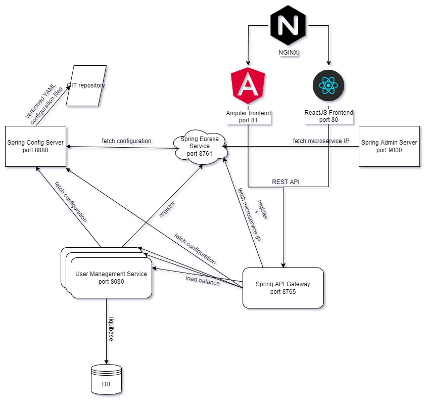

# Docker, Docker Compose, Microservices, Spring Cloud, Spring Boot, React, Angular, H2, Hibernate, Liquibase



The application structure is as follows.
- **admin-server** - Microservice implemented using Spring Admin Server. [More info](admin-server/README.md)
- **config-server** - Microservice implemented using Spring Config Server. [More info](config-server/README.md)
- **eureka-discovery-service** - Microservice implemented using Spring Eureka. [More info](eureka-discovery-service/README.md)
- **gateway-service** - Microservice implemented using Spring Cloud Gateway. [More info](gateway-service/README.md)
- **user-management-service** - Microservice implemented using Spring boot. [More info](user-management-service/README.md)
- **react-client** - A NodeJs application implemented using React. This consumes services hosted by server side. [More info](react-client/README.md)
- **angular-client** - A NodeJs application implemented using Angular. This consumes services hosted by server side. [More info](angular-client/README.md)

### Build

#### 1) Build and Run Spring Boot microservices
   
```
$ cd microservices path
$ mvnw clean install
$ mvnw spring-boot:run
```

#### 2) Build and Run client side application

React
```
$ cd react-client
$ yarn install
$ yarn start
```

Angular
```
$ cd angular-client
$ npm install
$ ng serve
```


### Access client applications using following URL

React
```
http://localhost:3000
```

Angular
```
http://localhost:4200
```

### Performance / Load tests

Test structure is as follows.
- **perf-test** - A Apache JMeter test plan designed to load test functional behavior and measure performance. [More info](perf-test/README.md)

### Docker / Kubernetes

#### 1) Build and Test all modules

```
mvnw clean install
```

#### 2) Build, Push and Run docker

```
docker-compose build --pull
docker-compose push
docker-compose up -d
```

#### 2) Start minikube and deploy all applications (Kubernetes)
```
minikube start
minikube dashboard

kubectl create deployment eureka-discovery-service --image=mariobros/eureka-discovery-service:0.0.1-SNAPSHOT --port=8761
kubectl expose deployment eureka-discovery-service --type=NodePort

kubectl create deployment config-server --image=mariobros/config-server:0.0.1-SNAPSHOT --port=8888
kubectl expose deployment config-server --type=NodePort

kubectl create deployment admin-server --image=mariobros/admin-server:0.0.1-SNAPSHOT --port=9000
kubectl expose deployment admin-server --type=NodePort

kubectl create deployment gateway-service --image=mariobros/gateway-service:0.0.1-SNAPSHOT --port=8765
kubectl expose deployment gateway-service --type=NodePort

kubectl create deployment user-management-service --image=mariobros/user-management-service:0.0.1-SNAPSHOT --port=8080
kubectl expose deployment user-management-service --type=NodePort

kubectl create deployment angular-client --image=mariobros/angular-client:0.0.1-SNAPSHOT --port=81
kubectl expose deployment angular-client --type=NodePort

kubectl create deployment react-client --image=mariobros/react-client:0.0.1-SNAPSHOT --port=82
kubectl expose deployment react-client --type=NodePort

kubectl create deployment nginx --image=mariobros/nginx:0.0.1-SNAPSHOT --port=80
kubectl expose deployment nginx --type=NodePort

kubectl create deployment prometheus --image=mariobros/prometheus:0.0.1-SNAPSHOT --port=9090
kubectl expose deployment prometheus --type=NodePort

kubectl create deployment grafana --image=grafana/grafana:latest --port=3000
kubectl expose deployment grafana --type=NodePort
```
